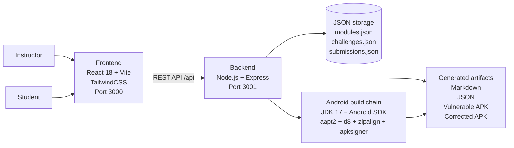

# VulnLab — Vulnerable Mobile Lab Generator

VulnLab is a Dockerized educational platform for building controlled mobile security laboratories. It helps instructors generate vulnerable-by-design Android training challenges, export the learning material, distribute a challenge link to students, and review submitted answers from an administrator dashboard.

The project is designed for academic and defensive security training. The generated applications use synthetic scenarios and must only be analyzed in an authorized laboratory environment.

---

## Table of contents

- [Overview](#overview)
- [Main capabilities](#main-capabilities)
- [Demonstration](#demonstration)
- [Software architecture](#software-architecture)
- [Repository structure](#repository-structure)
- [Technology stack](#technology-stack)
- [Quick start with Docker](#quick-start-with-docker)
- [Local development setup](#local-development-setup)
- [API reference](#api-reference)
- [Available vulnerability modules](#available-vulnerability-modules)
- [Instructor workflow](#instructor-workflow)
- [Student workflow](#student-workflow)
- [Generated artifacts](#generated-artifacts)
- [Adding a new module](#adding-a-new-module)
- [Safety and ethical use](#safety-and-ethical-use)
- [Troubleshooting](#troubleshooting)
- [License](#license)

---

## Overview

Cybersecurity courses often require practical environments where students can safely observe, analyze, and document common vulnerabilities. Preparing these exercises manually takes time because an instructor must write the scenario, prepare vulnerable code, provide a corrected version, design questions, define an evaluation grid, and distribute files to students.

VulnLab centralizes this process in a single web platform. The instructor selects a vulnerability module, configures a challenge, generates the corresponding learning material, and can provide students with a controlled challenge page. Students analyze the generated APK or code material, answer the quiz, submit the expected flag, and write a short technical explanation. The instructor can then review submissions and assign feedback.

---

## Main capabilities

- Generation of vulnerable-by-design Android and secure-coding laboratories.
- Challenge mode with student access link, quiz, flag submission, and write-up field.
- Administrator dashboard for challenge creation, monitoring, and evaluation.
- Markdown and JSON exports for course material reuse.
- APK generation pipeline for vulnerable and corrected Android applications.
- Progressive hints and teacher correction material.
- Docker-based deployment for reproducible classroom installation.
- JSON-based persistence for modules, challenges, and submissions.

---

## Demonstration

A demonstration video can be linked directly from this section and stored in the repository for archival use.

- YouTube demonstration: [VulnLab demonstration video](https://youtu.be/fKVrczlnqhc)


---

## Software architecture

VulnLab follows a client-server architecture. The frontend provides the web interface used by instructors and students. The backend exposes REST APIs for module listing, challenge generation, exports, APK creation, and submission management. Data is persisted in JSON files, which keeps the prototype lightweight and easy to deploy in a classroom. The Android build chain is isolated in the backend environment and produces installable APK artifacts.



### Data flow

1. The instructor configures a challenge from the React interface.
2. The frontend sends the request to the Express backend through `/api` routes.
3. The backend reads the selected module from JSON storage.
4. The generator service builds the challenge structure, quiz, hints, and teacher correction.
5. If APK generation is requested, the backend invokes the Android build tools.
6. The generated artifacts are returned to the frontend or stored for later download.
7. The student accesses the challenge, submits answers, and the backend records the submission.
8. The administrator reviews the submission from the dashboard.

---

## Repository structure

```text
apk_vulnerable_generator/
├── backend/
│   ├── Dockerfile
│   ├── package.json
│   ├── server.js
│   ├── routes/
│   │   ├── modules.js
│   │   ├── generate.js
│   │   ├── export.js
│   │   ├── apk.js
│   │   └── challenges.js
│   ├── services/
│   │   ├── generatorService.js
│   │   ├── markdownService.js
│   │   ├── apkBuilderService.js
│   │   ├── apkTemplates.js
│   │   ├── challengeGeneratorService.js
│   │   └── quizGeneratorService.js
│   └── data/
│       ├── modules.json
│       ├── challenges.json
│       └── submissions.json
├── frontend/
│   ├── Dockerfile
│   ├── package.json
│   ├── vite.config.js
│   ├── tailwind.config.js
│   ├── postcss.config.js
│   ├── index.html
│   └── src/
│       ├── main.jsx
│       ├── App.jsx
│       ├── pages/
│       ├── components/
│       └── styles/
├── docs/
│   ├── demo/
│   │   └── vulnlab-demo.mp4
│   └── screenshots/
├── docker-compose.yml
├── PROJECT.md
├── LICENSE
└── README.md
```

---

## Technology stack

| Layer | Technologies | Role |
|---|---|---|
| Frontend | React 18, Vite, TailwindCSS, React Router | Web interface, challenge pages, forms, previews, dashboard views |
| Backend | Node.js, Express | REST API, generation services, exports, APK build orchestration |
| Storage | JSON files | Lightweight persistence for modules, challenges, and submissions |
| Android build chain | JDK 17, Android SDK, aapt2, d8, zipalign, apksigner | Generation, alignment, and signing of APK files |
| Deployment | Docker, Docker Compose | Reproducible execution without installing all dependencies on the host |

---

## Quick start with Docker

```bash
git clone https://github.com/Jettleee/apk_vulnerable_generator.git
cd apk_vulnerable_generator
docker compose up --build
```

Open the platform:

```text
http://localhost:3000
```

Backend API:

```text
http://localhost:3001
```

Health check:

```bash
curl http://localhost:3001/api/health
```

---

## Local development setup

### Prerequisites

- Node.js 18+
- npm
- JDK 17
- Android SDK and Android Build Tools
- Docker and Docker Compose for the recommended setup

### Backend

```bash
cd backend
npm install
node server.js
```

The backend runs on:

```text
http://localhost:3001
```

### Frontend

```bash
cd frontend
npm install
npm run dev
```

The frontend runs on:

```text
http://localhost:3000
```

---

## API reference

| Method | Route | Input | Output | Purpose |
|---|---|---|---|---|
| GET | `/api/health` | None | Health status | Check whether the backend is available |
| GET | `/api/modules` | Optional filters | Module list | List available vulnerability modules |
| GET | `/api/modules/:id` | Module identifier | Module details | Retrieve one module |
| POST | `/api/generate` | Lab configuration | Generated lab | Create a structured training lab |
| POST | `/api/export/markdown` | Lab object | Markdown file/content | Export a lab in Markdown format |
| POST | `/api/apk/build` | APK generation options | APK artifact | Build a vulnerable or corrected APK |
| GET | `/api/challenges` | None | Challenge list | List generated challenges |
| POST | `/api/challenges` | Challenge configuration | Created challenge | Create a challenge session |
| GET | `/api/challenges/:id` | Challenge identifier | Challenge details | Retrieve a challenge |
| POST | `/api/challenges/:id/submit` | Student name, answers, flag, write-up | Submission result | Submit a student attempt |
| POST | `/api/challenges/:id/evaluate` | Evaluation data | Updated submission | Record instructor feedback |

### Example challenge generation request

```json
{
  "moduleId": "exported-component",
  "level": "beginner",
  "questionCount": 10,
  "showFixedVersion": false
}
```

---

## Available vulnerability modules

| Module | Level | Category | Learning objective |
|---|---|---|---|
| Exported Component | Beginner | Android | Understand the risk of exposing an Android component without proper access control |
| Hardcoded Secret | Beginner | Android | Identify credentials or secrets embedded directly in application code |
| Cleartext Network Config | Beginner | Android | Understand the impact of unencrypted HTTP traffic |
| Sensitive Data in Logs | Beginner | Android | Detect sensitive values written to application logs |
| Insecure File Permission | Intermediate | Android | Review local storage and file permission weaknesses |
| Weak Input Validation | Intermediate | Secure coding | Analyze insufficient input validation and its consequences |
| Insecure Debug Mode | Intermediate | Android | Understand the risks of shipping a debug-enabled application |
| Vulnerable JNI Native Check | Advanced | Native Android | Study why local client-side native checks are not sufficient as a security boundary |

---

## Instructor workflow

1. Start the platform.
2. Open the administrator dashboard.
3. Select a vulnerability module.
4. Configure the difficulty level and number of quiz questions.
5. Generate the challenge.
6. Share the student challenge link.
7. Monitor submissions from the dashboard.
8. Review the submitted flag, quiz answers, and write-up.
9. Add instructor feedback and evaluation.
10. Export the generated material for course archives.

---

## Student workflow

1. Open the challenge link provided by the instructor.
2. Read the objective, risk description, and challenge instructions.
3. Download the generated APK or inspect the provided code material.
4. Analyze the vulnerability in a controlled environment.
5. Use the hints only when needed.
6. Answer the quiz questions.
7. Submit the flag and write-up.
8. Wait for instructor review.

---

## Generated artifacts

Depending on the selected workflow, VulnLab can generate or export:

- A structured laboratory description.
- A Markdown export for course documentation.
- A JSON export for reuse or integration.
- A vulnerable APK for student analysis.
- A corrected APK for instructor demonstration or comparison.
- Quiz questions and expected answers.
- Progressive hints.
- Teacher correction material.
- Student submissions and instructor evaluations.

Recommended repository locations for documentation assets:

```text
docs/demo/vulnlab-demo.mp4
docs/screenshots/admin-dashboard.png
docs/screenshots/student-challenge.png
docs/screenshots/apk-download.png
docs/screenshots/submission-review.png
```

---

## Adding a new module

New modules are defined in `backend/data/modules.json`. A module describes the vulnerability, the learning objective, examples, correction material, quiz questions, and evaluation elements.

```json
{
  "id": "unique-module-id",
  "name": "Module Display Name",
  "category": "android",
  "difficulty": "beginner",
  "description": "Short description of the vulnerability scenario.",
  "risk": "Security impact explained for students.",
  "learningObjective": "What the student should learn.",
  "vulnerableExample": "Vulnerable code example.",
  "fixedExample": "Corrected code example.",
  "studentTask": "Instructions for the student.",
  "teacherCorrection": "Expected answer and correction notes.",
  "testCheck": "Verification method.",
  "checklist": [
    "Observation point 1",
    "Observation point 2"
  ],
  "qcm": [
    {
      "question": "Question text?",
      "choices": ["A", "B", "C", "D"],
      "correct": "A",
      "explanation": "Why the answer is correct."
    }
  ],
  "rubric": [
    {
      "criterion": "Technical explanation",
      "weight": "40%"
    }
  ]
}
```

After saving the JSON file, restart the backend if the module is not loaded automatically.

---

## Safety and ethical use

VulnLab is intended for controlled education, defensive training, and authorized laboratory work only.

The generated APKs are intentionally vulnerable and must not be used against real users, real services, third-party applications, production systems, banking applications, DRM systems, or payment applications. JNI and Frida-related examples are limited to the generated toy APK package and are included only to demonstrate why client-side checks are not a sufficient security boundary.

Students should work on emulators or dedicated test devices and must follow the rules defined by the instructor.

---

## Troubleshooting

| Problem | Possible cause | Resolution |
|---|---|---|
| Frontend does not load | Container not started or port conflict | Check `docker compose ps` and verify port `3000` |
| Backend API unavailable | Backend container failed | Check backend logs with `docker compose logs backend` |
| APK build fails | Android SDK or build tools unavailable | Use the Docker setup or verify SDK paths |
| Empty module list | `modules.json` missing or invalid | Validate JSON syntax and restart backend |
| Submission not saved | Storage file missing or permission issue | Check backend write permissions in the data directory |

---

## License

This project is distributed under the MIT License. See the [`LICENSE`](LICENSE) file for details.

---

## Citation

```bibtex
@software{vulnlab_2026,
  title        = {VulnLab: Vulnerable Mobile Lab Generator},
  author       = {Bril Mohamed , Charaf Youssef , Charraj Mouad and El Bekkali Ibtissam},
  year         = {2026},
  url          = {https://github.com/Jettleee/apk_vulnerable_generator},
  license      = {MIT}
}
```
